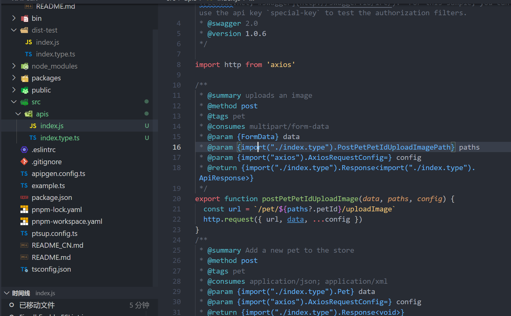

# API Generator

> [中文](./README.md) | English

API generator, which is used to convert OpenApi (v2~v3) and other input sources into TS/JS APIs, and currently supports axios pipeline

- `swag-axios-ts`
- `swag-axios-js`
- `swag-fetch-ts`
- `swag-fetch-js`
- `swag-ky-ts`
- `swag-ky-js`
- `swag-got-js`
- `swag-got-js`

## ⚙️ Install

Install it locally in your project folder:

```bash
pnpm add @genapi/cli @genapi/swag-axios-ts -D
# Or Yarn
yarn add @genapi/cli @genapi/swag-axios-ts --dev
```

You can also install it globally but it's not recommended.

## 📖 Usage

Currently, the CLI option is not provided, and the output content is determined by the config file. Currently, the following config files are supported:

- `genapi.config.ts`
- `genapi.config.js`
- `genapi.config.cjs`
- `genapi.config.json`

```ts
import { defineConfig } from '@genapi/config'

export default defineConfig({
  // your input source and output file (swagger api url or json)
  // if you have multiple sources, you can use 'server'
  input: 'http://...api-docs',
  output: {
    main: 'src/api/index.ts',
    type: 'src/api/index.type.ts',
  },

  // your API baseUrl
  baseURL: 'import.meta.env.VITE_APP_BASE_API',
  // customize the output response type. default 'T'
  responseType: 'T extends { data?: infer V } ? V : void',
})
```

```sh
# run genapi
pnpm@genapi/ or genapi--pipe swag-axios-ts
```


## Input

Input supports three input sources `url|json`

```ts
export default defineConfig({
  // directly pass in url
  input: 'http://...api-docs',
  // or
  input: { /* url|json */ }
})
```

## Server

Maybe you have multiple services. You can use 'server' to set multiple services. Usually, other config at the top level are used as additional config

```ts
export default defineConfig({
  // Your API baseUrl, this configuration will be passed to the axios request
  baseUrl: 'https://...',
  // all servers inherit the upper layer configuration
  server: [
    { import: '...', output: {/* ... */} },
    { import: '...', output: {/* ... */} },
    { import: '...', output: {/* ... */} },
  ]
})
```

## swag-axios-js

Use the `swag-axios-js` pipeline to generate JavaScript files with both types.

```ts
export default defineConfig({
  pipeline: 'swag-axios-js',
  input: {
    uri: 'https://petstore.swagger.io/v2/swagger.json',
  },
})
```

Run `genapi`



## Pipeline

When defining the configuration, genapi passes in the 'pipeline' parameter to support the npm package (prefix `@genapi/` and `genapi-`) and local path.

```ts
export default defineConfig({
  pipeline: './custom-pipe',
})
```

pipeline is defined by the `pipeline` method provided by `genapi`.

```ts
// custom-pipe.ts

// create an API pipeline generator using the pipeline provided by genapi
import { pipeline } from '@genapi/core'

// each pipeline exposes corresponding methods, which can be reused and reorganized
import { dest, generate, original } from '@genapi/swag-axios-ts'

function myCustomPipe(config) {
  const process = pipeline(
    // read config, convert to internal config, and provide default values
    config => readConfig(config),
    // get data source
    configRead => original(configRead),
    // parse the data source as data graphs
    configRead => parser(configRead),
    // compile data and convert it into abstract syntax tree (AST)
    configRead => compiler(configRead),
    // generate code string
    configRead => generate(configRead),
    // use outputs to output files
    configRead => dest(configRead),
  )
  return process(config)
}

function readConfig(config) {
  // ...
}

function parser(configRead) {
  // ...
}

function compiler(configRead) {
  // ...
}
```
